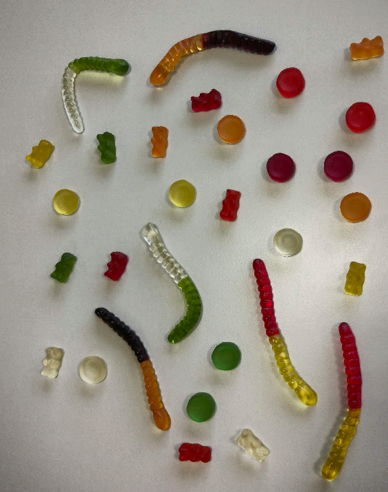

# Gummies detection

Image processing project implemented at the university as part of the subject vision systems. Uses to **Python** programming language and the open source computer vision library **OpenCv**. The assumptions of the project are the detection of jellies and counting them. 

The *train* folder contains training data. Each photo shows a collection of gummies of different colors and shapes. Using computer methods of image processing, the algorithm correctly counts all jelly beans.

